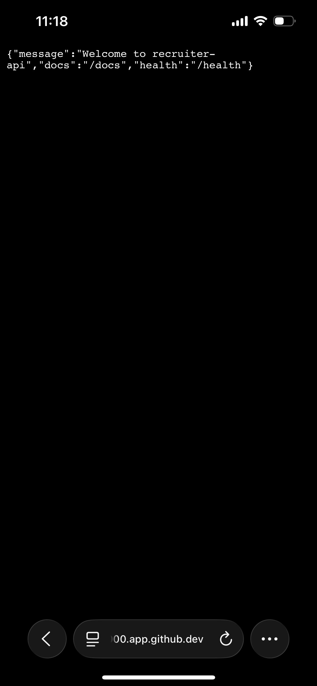

[English](README.md) | **Español**

# DevLaunch Lite

> Genera servicios FastAPI listos para producción con pruebas, Docker e integración continua en segundos.

[](https://github.com/cronoss20/devlaunch-lite/actions/workflows/ci.yml)
[](https://www.python.org/downloads/)
[](LICENSE)



## Descripción

Crear un nuevo servicio backend suele exigir configurar repetidamente carpetas, pruebas, análisis de código, Docker, documentación y CI/CD.

DevLaunch Lite automatiza todo ese proceso mediante una interfaz de línea de comandos y genera un servicio FastAPI limpio y preparado para ejecutarse.

## Funcionalidades

- Generación automática de servicios FastAPI
- Documentación interactiva con OpenAPI
- Endpoints `/` y `/health`
- Pruebas automáticas con Pytest
- Análisis de calidad con Ruff
- Comprobación de tipos con MyPy
- Docker y Docker Compose
- Integración continua con GitHub Actions
- Validación del nombre del proyecto
- Protección frente a directorios existentes
- Diagnóstico del entorno con `devlaunch doctor`
- Documentación generada automáticamente

## Instalación rápida

DevLaunch Lite requiere Python 3.11 o superior.

```bash
git clone https://github.com/cronoss20/devlaunch-lite.git
cd devlaunch-lite

python -m venv .venv
source .venv/bin/activate

pip install -e ".[dev]"
devlaunch create recruiter-api
```

Para ejecutar el servicio generado:

```bash
cd recruiter-api
pip install -e ".[dev]"
pytest
uvicorn app.main:app --reload
```

Abre la documentación interactiva en:

```text
http://127.0.0.1:8000/docs
```

## Comandos principales

Crear un nuevo servicio:

```bash
devlaunch create payments-api
```

Elegir otra carpeta de destino:

```bash
devlaunch create payments-api --destination /tmp
```

Añadir una descripción personalizada:

```bash
devlaunch create payments-api \
  --description "Servicio interno de pagos"
```

Comprobar el entorno de desarrollo:

```bash
devlaunch doctor
```

## Arquitectura


Puedes consultar más información en [docs/architecture.md](docs/architecture.md).

## Controles de calidad

```bash
ruff check .
mypy src
pytest
```

Cada envío de código y cada pull request también se comprueba automáticamente mediante GitHub Actions.

## Decisiones técnicas

- **Python y Typer:** interfaz de comandos tipada y fácil de utilizar.
- **Jinja2:** separación clara entre la lógica y las plantillas.
- **Variables estrictas:** evita generar proyectos incompletos.
- **Primera versión enfocada:** una plantilla FastAPI completa en lugar de varias incompletas.
- **Calidad automatizada:** pruebas, linting y tipado en cada cambio.

## Próximas mejoras

- [ ] Asistente interactivo de configuración
- [ ] PostgreSQL como opción
- [ ] Instrumentación con OpenTelemetry
- [ ] Plantilla para Node.js
- [ ] Publicación del paquete en PyPI

## Autor

**Ángel Sierra — [cronoss20](https://github.com/cronoss20)**

Proyecto de portfolio centrado en Developer Experience, automatización, herramientas reutilizables y calidad de software.

## Licencia

Distribuido bajo licencia MIT. Consulta el archivo [LICENSE](LICENSE).
