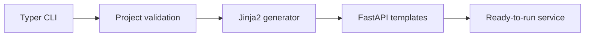

[English](README.md) | [Español](README.es.md)

# DevLaunch Lite

> Generate a production-ready FastAPI service with testing, Docker and CI in seconds.

[](https://github.com/cronoss20/devlaunch-lite/actions/workflows/ci.yml)
[](https://www.python.org/)
[](LICENSE)

## The problem

Starting a backend service usually means repeating the same setup: folders, testing, linting, Docker, documentation and continuous integration. This creates inconsistency and wastes engineering time.

## The solution

DevLaunch Lite is an opinionated command-line tool that generates a clean FastAPI service with the essential engineering foundations already configured.

## Demo

```console
$ devlaunch create payments-api
Project generated successfully.
Location: /workspace/payments-api
Next steps:
  cd payments-api
  python -m venv .venv
  pip install -e '.[dev]'
  pytest
```

Generated structure:

```text
payments-api/
├── .github/workflows/ci.yml
├── app/
│   ├── __init__.py
│   └── main.py
├── tests/test_health.py
├── .env.example
├── .gitignore
├── Dockerfile
├── Makefile
├── README.md
├── docker-compose.yml
└── pyproject.toml
```

## Features

- FastAPI starter service
- `/health` and `/` endpoints
- Pytest test suite
- Ruff linting
- Docker and Docker Compose
- GitHub Actions CI
- Generated documentation
- Project-name validation
- Safe handling of existing directories
- Environment diagnostics with `devlaunch doctor`

## Quick start

```bash
python -m venv .venv
source .venv/bin/activate
pip install -e '.[dev]'
devlaunch create payments-api
```

Correct final command:

```bash
cd payments-api
pip install -e '.[dev]'
pytest
uvicorn app.main:app --reload
```

## Development

```bash
pip install -e '.[dev]'
ruff check .
mypy src
pytest
```

## Architecture



More detail: [docs/architecture.md](docs/architecture.md)

## Design decisions

- **Python and Typer:** fast development with a typed, discoverable CLI.
- **Jinja2 templates:** clear separation between generation logic and generated files.
- **Strict template variables:** missing context fails early instead of generating broken code.
- **Small first release:** one excellent FastAPI template rather than many incomplete templates.

## Roadmap

- [ ] Add a Node.js template
- [ ] Add PostgreSQL as an optional component
- [ ] Add OpenTelemetry instrumentation
- [ ] Add an interactive configuration wizard
- [ ] Publish the package to PyPI

## Security

Never place API keys, passwords or personal data in generated projects. See [SECURITY.md](SECURITY.md).

## License

MIT License. See [LICENSE](LICENSE).

## Demo

DevLaunch Lite generates a ready-to-run FastAPI service with interactive API documentation.


