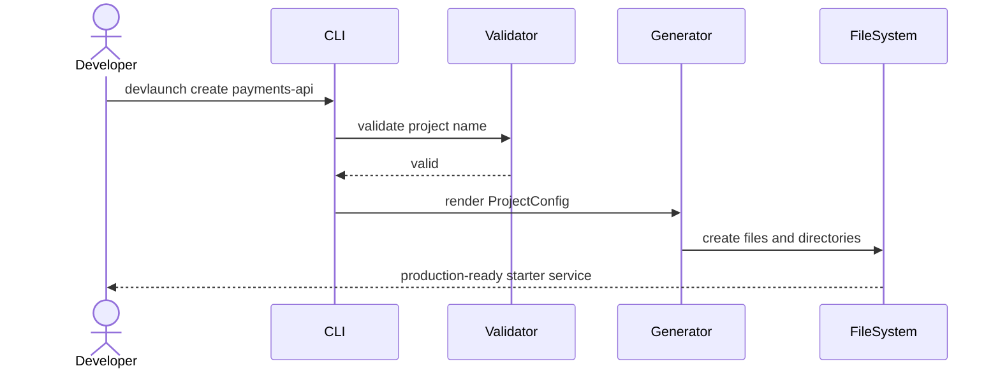

# Architecture

DevLaunch Lite has three deliberately small layers:

1. **CLI layer** — parses commands and presents actionable feedback.
2. **Domain layer** — validates project configuration and protects existing directories.
3. **Template layer** — renders a complete FastAPI service using strict Jinja2 templates.

## Generation flow

## Failure modes

- Invalid names produce a clear non-zero exit.
- Existing directories are protected unless `--force` is supplied.
- Undefined template variables fail immediately through `StrictUndefined`.
- CI runs linting, static typing and tests on every push and pull request.
